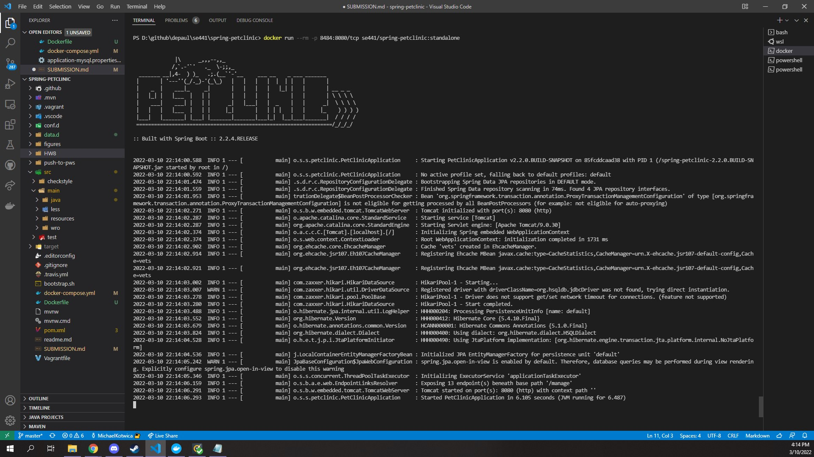

# Michael Kotwica


### DOCKER

### 1.)
[My dockerfile](/Dockerfile)
### 2.)

### 3.)


### MYSQL ONLY

### 4.)
```
PS D:\github\depaul\se441\spring-petclinic> docker-compose up
[+] Running 2/0
 - Container spring-petclinic-mysql-1   Created                                                                                                                                                             0.0s 
 - Container spring-petclinic-webapp-1  Created                                                                                                                                                             0.0s 
Attaching to spring-petclinic-mysql-1, spring-petclinic-webapp-1
spring-petclinic-mysql-1   | 2022-03-10 22:26:55+00:00 [Note] [Entrypoint]: Entrypoint script for MySQL Server 5.7.37-1debian10 started.
spring-petclinic-mysql-1   | 2022-03-10 22:26:55+00:00 [Note] [Entrypoint]: Switching to dedicated user 'mysql'
spring-petclinic-mysql-1   | 2022-03-10 22:26:55+00:00 [Note] [Entrypoint]: Entrypoint script for MySQL Server 5.7.37-1debian10 started.
spring-petclinic-mysql-1   | 2022-03-10T22:26:55.885431Z 0 [Warning] TIMESTAMP with implicit DEFAULT value is deprecated. Please use --explicit_defaults_for_timestamp server option (see documentation for more 
details).
spring-petclinic-mysql-1   | 2022-03-10T22:26:55.890584Z 0 [Note] mysqld (mysqld 5.7.37) starting as process 1 ...
spring-petclinic-mysql-1   | 2022-03-10T22:26:55.894506Z 0 [Warning] Setting lower_case_table_names=2 because file system for /var/lib/mysql/ is case insensitive
spring-petclinic-mysql-1   | 2022-03-10T22:26:55.895691Z 0 [Note] InnoDB: PUNCH HOLE support available
spring-petclinic-mysql-1   | 2022-03-10T22:26:55.895724Z 0 [Note] InnoDB: Mutexes and rw_locks use GCC atomic builtins
spring-petclinic-mysql-1   | 2022-03-10T22:26:55.895727Z 0 [Note] InnoDB: Uses event mutexes
spring-petclinic-mysql-1   | 2022-03-10T22:26:55.895729Z 0 [Note] InnoDB: GCC builtin __atomic_thread_fence() is used for memory barrier
spring-petclinic-mysql-1   | 2022-03-10T22:26:55.895731Z 0 [Note] InnoDB: Compressed tables use zlib 1.2.11
spring-petclinic-mysql-1   | 2022-03-10T22:26:55.895878Z 0 [Note] InnoDB: Number of pools: 1
spring-petclinic-mysql-1   | 2022-03-10T22:26:55.895947Z 0 [Note] InnoDB: Using CPU crc32 instructions
spring-petclinic-mysql-1   | 2022-03-10T22:26:55.896891Z 0 [Note] InnoDB: Initializing buffer pool, total size = 128M, instances = 1, chunk size = 128M
spring-petclinic-mysql-1   | 2022-03-10T22:26:55.902424Z 0 [Note] InnoDB: Completed initialization of buffer pool
spring-petclinic-mysql-1   | 2022-03-10T22:26:55.905202Z 0 [Note] InnoDB: If the mysqld execution user is authorized, page cleaner thread priority can be changed. See the man page of setpriority().
spring-petclinic-mysql-1   | 2022-03-10T22:26:55.940559Z 0 [Note] InnoDB: Highest supported file format is Barracuda.
spring-petclinic-mysql-1   | 2022-03-10T22:26:56.023709Z 0 [Note] InnoDB: Creating shared tablespace for temporary tables
spring-petclinic-mysql-1   | 2022-03-10T22:26:56.025000Z 0 [Note] InnoDB: Setting file './ibtmp1' size to 12 MB. Physically writing the file full; Please wait ...
spring-petclinic-mysql-1   | 2022-03-10T22:26:56.302490Z 0 [Note] InnoDB: File './ibtmp1' size is now 12 MB.
spring-petclinic-mysql-1   | 2022-03-10T22:26:56.305392Z 0 [Note] InnoDB: 96 redo rollback segment(s) found. 96 redo rollback segment(s) are active.
spring-petclinic-mysql-1   | 2022-03-10T22:26:56.305431Z 0 [Note] InnoDB: 32 non-redo rollback segment(s) are active.
spring-petclinic-mysql-1   | 2022-03-10T22:26:56.306498Z 0 [Note] InnoDB: 5.7.37 started; log sequence number 12661069
spring-petclinic-mysql-1   | 2022-03-10T22:26:56.306851Z 0 [Note] Plugin 'FEDERATED' is disabled.
spring-petclinic-mysql-1   | 2022-03-10T22:26:56.308909Z 0 [Note] InnoDB: Loading buffer pool(s) from /var/lib/mysql/ib_buffer_pool
spring-petclinic-mysql-1   | 2022-03-10T22:26:56.356889Z 0 [Note] Found ca.pem, server-cert.pem and server-key.pem in data directory. Trying to enable SSL support using them.
spring-petclinic-mysql-1   | 2022-03-10T22:26:56.356922Z 0 [Note] Skipping generation of SSL certificates as certificate files are present in data directory.
spring-petclinic-mysql-1   | 2022-03-10T22:26:56.356928Z 0 [Warning] A deprecated TLS version TLSv1 is enabled. Please use TLSv1.2 or higher.
spring-petclinic-mysql-1   | 2022-03-10T22:26:56.356930Z 0 [Warning] A deprecated TLS version TLSv1.1 is enabled. Please use TLSv1.2 or higher.
spring-petclinic-mysql-1   | 2022-03-10T22:26:56.365079Z 0 [Warning] CA certificate ca.pem is self signed.
spring-petclinic-mysql-1   | 2022-03-10T22:26:56.367052Z 0 [Note] Skipping generation of RSA key pair as key files are present in data directory.
spring-petclinic-mysql-1   | 2022-03-10T22:26:56.371254Z 0 [Note] InnoDB: Buffer pool(s) load completed at 220310 22:26:56
spring-petclinic-mysql-1   | 2022-03-10T22:26:56.372653Z 0 [Note] Server hostname (bind-address): '*'; port: 3306
spring-petclinic-mysql-1   | 2022-03-10T22:26:56.372699Z 0 [Note] IPv6 is available.
spring-petclinic-mysql-1   | 2022-03-10T22:26:56.372707Z 0 [Note]   - '::' resolves to '::';
spring-petclinic-mysql-1   | 2022-03-10T22:26:56.372715Z 0 [Note] Server socket created on IP: '::'.
spring-petclinic-mysql-1   | 2022-03-10T22:26:56.380844Z 0 [Warning] Insecure configuration for --pid-file: Location '/var/run/mysqld' in the path is accessible to all OS users. Consider choosing a different directory.
spring-petclinic-mysql-1   | 2022-03-10T22:26:56.679103Z 0 [Note] Event Scheduler: Loaded 0 events
spring-petclinic-mysql-1   | 2022-03-10T22:26:56.679766Z 0 [Note] mysqld: ready for connections.
spring-petclinic-mysql-1   | Version: '5.7.37'  socket: '/var/run/mysqld/mysqld.sock'  port: 3306  MySQL Community Server (GPL)
spring-petclinic-webapp-1  | 
spring-petclinic-webapp-1  | 
spring-petclinic-webapp-1  |               |\      _,,,--,,_
spring-petclinic-webapp-1  |              /,`.-'`'   ._  \-;;,_
spring-petclinic-webapp-1  |   _______ __|,4-  ) )_   .;.(__`'-'__     ___ __    _ ___ _______
spring-petclinic-webapp-1  |  |       | '---''(_/._)-'(_\_)   |   |   |   |  |  | |   |       |
spring-petclinic-webapp-1  |  |    _  |    ___|_     _|       |   |   |   |   |_| |   |       | __ _ _
spring-petclinic-webapp-1  |  |   |_| |   |___  |   | |       |   |   |   |       |   |       | \ \ \ \
spring-petclinic-webapp-1  |  |    ___|    ___| |   | |      _|   |___|   |  _    |   |      _|  \ \ \ \
spring-petclinic-webapp-1  |  |   |   |   |___  |   | |     |_|       |   | | |   |   |     |_    ) ) ) )
spring-petclinic-webapp-1  |  |___|   |_______| |___| |_______|_______|___|_|  |__|___|_______|  / / / /
spring-petclinic-webapp-1  |  ==================================================================/_/_/_/
spring-petclinic-webapp-1  |
spring-petclinic-webapp-1  | :: Built with Spring Boot :: 2.2.4.RELEASE
spring-petclinic-webapp-1  |
spring-petclinic-webapp-1  |
spring-petclinic-webapp-1  | 2022-03-10 22:26:58.108  INFO 1 --- [           main] o.s.s.petclinic.PetClinicApplication     : Starting PetClinicApplication v2.2.0.BUILD-SNAPSHOT on c218ed6b97e4 with PID 1 (/spring-petclinic-2.2.0.BUILD-SNAPSHOT.jar started by root in /)
spring-petclinic-webapp-1  | 2022-03-10 22:26:58.114  INFO 1 --- [           main] o.s.s.petclinic.PetClinicApplication     : No active profile set, falling back to default profiles: default
spring-petclinic-webapp-1  | 2022-03-10 22:26:59.223  INFO 1 --- [           main] .s.d.r.c.RepositoryConfigurationDelegate : Bootstrapping Spring Data JPA repositories in DEFAULT mode.
spring-petclinic-webapp-1  | 2022-03-10 22:26:59.310  INFO 1 --- [           main] .s.d.r.c.RepositoryConfigurationDelegate : Finished Spring Data repository scanning in 75ms. Found 4 JPA repository interfaces.
spring-petclinic-webapp-1  | 2022-03-10 22:26:59.670  INFO 1 --- [           main] trationDelegate$BeanPostProcessorChecker : Bean 'org.springframework.transaction.annotation.ProxyTransactionManagementConfiguration' of type [org.springframework.transaction.annotation.ProxyTransactionManagementConfiguration] is not eligible for getting processed by all BeanPostProcessors (for example: not eligible for auto-proxying)spring-petclinic-webapp-1  | 2022-03-10 22:27:00.004  INFO 1 --- [           main] o.s.b.w.embedded.tomcat.TomcatWebServer  : Tomcat initialized with port(s): 8080 (http)
spring-petclinic-webapp-1  | 2022-03-10 22:27:00.034  INFO 1 --- [           main] o.apache.catalina.core.StandardService   : Starting service [Tomcat]
spring-petclinic-webapp-1  | 2022-03-10 22:27:00.034  INFO 1 --- [           main] org.apache.catalina.core.StandardEngine  : Starting Servlet engine: [Apache Tomcat/9.0.30]
spring-petclinic-webapp-1  | 2022-03-10 22:27:00.100  INFO 1 --- [           main] o.a.c.c.C.[Tomcat].[localhost].[/]       : Initializing Spring embedded WebApplicationContext
spring-petclinic-webapp-1  | 2022-03-10 22:27:00.100  INFO 1 --- [           main] o.s.web.context.ContextLoader            : Root WebApplicationContext: initialization completed in 1937 ms
spring-petclinic-webapp-1  | 2022-03-10 22:27:00.563  INFO 1 --- [           main] org.ehcache.core.EhcacheManager          : Cache 'vets' created in EhcacheManager.
spring-petclinic-webapp-1  | 2022-03-10 22:27:00.578  INFO 1 --- [           main] org.ehcache.jsr107.Eh107CacheManager     : Registering Ehcache MBean javax.cache:type=CacheStatistics,CacheManager=urn.X-ehcache.jsr107-default-config,Cache=vets
spring-petclinic-webapp-1  | 2022-03-10 22:27:00.583  INFO 1 --- [           main] org.ehcache.jsr107.Eh107CacheManager     : Registering Ehcache MBean javax.cache:type=CacheStatistics,CacheManager=urn.X-ehcache.jsr107-default-config,Cache=vets
spring-petclinic-webapp-1  | 2022-03-10 22:27:00.659  INFO 1 --- [           main] com.zaxxer.hikari.HikariDataSource       : HikariPool-1 - Starting...
spring-petclinic-webapp-1  | 2022-03-10 22:27:00.665  WARN 1 --- [           main] com.zaxxer.hikari.util.DriverDataSource  : Registered driver with driverClassName=org.hsqldb.jdbcDriver was not found, trying 
direct instantiation.
spring-petclinic-webapp-1  | 2022-03-10 22:27:00.972  INFO 1 --- [           main] com.zaxxer.hikari.pool.PoolBase          : HikariPool-1 - Driver does not support get/set network timeout for connections. (feature not supported)
spring-petclinic-webapp-1  | 2022-03-10 22:27:00.976  INFO 1 --- [           main] com.zaxxer.hikari.HikariDataSource       : HikariPool-1 - Start completed.
spring-petclinic-webapp-1  | 2022-03-10 22:27:01.196  INFO 1 --- [           main] o.hibernate.jpa.internal.util.LogHelper  : HHH000204: Processing PersistenceUnitInfo [name: default]
spring-petclinic-webapp-1  | 2022-03-10 22:27:01.266  INFO 1 --- [           main] org.hibernate.Version                    : HHH000412: Hibernate Core {5.4.10.Final}
spring-petclinic-webapp-1  | 2022-03-10 22:27:01.392  INFO 1 --- [           main] o.hibernate.annotations.common.Version   : HCANN000001: Hibernate Commons Annotations {5.1.0.Final}
spring-petclinic-webapp-1  | 2022-03-10 22:27:01.526  INFO 1 --- [           main] org.hibernate.dialect.Dialect            : HHH000400: Using dialect: org.hibernate.dialect.HSQLDialect
spring-petclinic-webapp-1  | 2022-03-10 22:27:02.319  INFO 1 --- [           main] o.h.e.t.j.p.i.JtaPlatformInitiator       : HHH000490: Using JtaPlatform implementation: [org.hibernate.engine.transaction.jta.platform.internal.NoJtaPlatform]
spring-petclinic-webapp-1  | 2022-03-10 22:27:02.328  INFO 1 --- [           main] j.LocalContainerEntityManagerFactoryBean : Initialized JPA EntityManagerFactory for persistence unit 'default'
spring-petclinic-webapp-1  | 2022-03-10 22:27:03.065  WARN 1 --- [           main] JpaBaseConfiguration$JpaWebConfiguration : spring.jpa.open-in-view is enabled by default. Therefore, database queries may be performed during view rendering. Explicitly configure spring.jpa.open-in-view to disable this warning
spring-petclinic-webapp-1  | 2022-03-10 22:27:03.212  INFO 1 --- [           main] o.s.s.concurrent.ThreadPoolTaskExecutor  : Initializing ExecutorService 'applicationTaskExecutor'
spring-petclinic-webapp-1  | 2022-03-10 22:27:04.458  INFO 1 --- [           main] o.s.b.a.e.web.EndpointLinksResolver      : Exposing 13 endpoint(s) beneath base path '/manage'
spring-petclinic-webapp-1  | 2022-03-10 22:27:04.609  INFO 1 --- [           main] o.s.b.w.embedded.tomcat.TomcatWebServer  : Tomcat started on port(s): 8080 (http) with context path ''
spring-petclinic-webapp-1  | 2022-03-10 22:27:04.611  INFO 1 --- [           main] o.s.s.petclinic.PetClinicApplication     : Started PetClinicApplication in 6.939 seconds (JVM running for 7.426)
```
### 5.)


### 6.)
```
PS D:\github\depaul\se441\spring-petclinic> docker-compose up
[+] Running 2/0
 - Container spring-petclinic-mysql-1   Created                                                                                                                                                             0.0s 
 - Container spring-petclinic-webapp-1  Created                                                                                                                                                             0.0s 
Attaching to spring-petclinic-mysql-1, spring-petclinic-webapp-1
```

### DOCKER COMPOSE - APP SERVER AND MYSQL

### 7.)

[docker-compose.yml](/docker-compose.yml)

### 8.)

[application-mysql.properties](/src/main/resources/application-mysql.properties)

### 9.)

```
PS D:\github\depaul\se441\spring-petclinic> docker-compose up
[+] Running 2/0
 - Container spring-petclinic-mysql-1   Created                                                                                                                                                             0.0s
 - Container spring-petclinic-webapp-1  Created                                                                                                                                                             0.0s
Attaching to spring-petclinic-mysql-1, spring-petclinic-webapp-1
spring-petclinic-mysql-1   | 2022-03-10 22:39:07+00:00 [Note] [Entrypoint]: Entrypoint script for MySQL Server 5.7.37-1debian10 started.
spring-petclinic-mysql-1   | 2022-03-10 22:39:07+00:00 [Note] [Entrypoint]: Switching to dedicated user 'mysql'
spring-petclinic-mysql-1   | 2022-03-10 22:39:07+00:00 [Note] [Entrypoint]: Entrypoint script for MySQL Server 5.7.37-1debian10 started.
spring-petclinic-mysql-1   | 2022-03-10T22:39:07.514123Z 0 [Warning] TIMESTAMP with implicit DEFAULT value is deprecated. Please use --explicit_defaults_for_timestamp server option (see documentation for more 
details).
spring-petclinic-mysql-1   | 2022-03-10T22:39:07.519883Z 0 [Note] mysqld (mysqld 5.7.37) starting as process 1 ...
spring-petclinic-mysql-1   | 2022-03-10T22:39:07.523831Z 0 [Warning] Setting lower_case_table_names=2 because file system for /var/lib/mysql/ is case insensitive
spring-petclinic-mysql-1   | 2022-03-10T22:39:07.524956Z 0 [Note] InnoDB: PUNCH HOLE support available
spring-petclinic-mysql-1   | 2022-03-10T22:39:07.524989Z 0 [Note] InnoDB: Mutexes and rw_locks use GCC atomic builtins
spring-petclinic-mysql-1   | 2022-03-10T22:39:07.524993Z 0 [Note] InnoDB: Uses event mutexes
spring-petclinic-mysql-1   | 2022-03-10T22:39:07.524994Z 0 [Note] InnoDB: GCC builtin __atomic_thread_fence() is used for memory barrier
spring-petclinic-mysql-1   | 2022-03-10T22:39:07.524996Z 0 [Note] InnoDB: Compressed tables use zlib 1.2.11
spring-petclinic-mysql-1   | 2022-03-10T22:39:07.525147Z 0 [Note] InnoDB: Number of pools: 1
spring-petclinic-mysql-1   | 2022-03-10T22:39:07.525221Z 0 [Note] InnoDB: Using CPU crc32 instructions
spring-petclinic-mysql-1   | 2022-03-10T22:39:07.526165Z 0 [Note] InnoDB: Initializing buffer pool, total size = 128M, instances = 1, chunk size = 128M
spring-petclinic-mysql-1   | 2022-03-10T22:39:07.531853Z 0 [Note] InnoDB: Completed initialization of buffer pool
spring-petclinic-mysql-1   | 2022-03-10T22:39:07.534587Z 0 [Note] InnoDB: If the mysqld execution user is authorized, page cleaner thread priority can be changed. See the man page of setpriority().
spring-petclinic-mysql-1   | 2022-03-10T22:39:07.580816Z 0 [Note] InnoDB: Highest supported file format is Barracuda.
spring-petclinic-mysql-1   | 2022-03-10T22:39:07.688876Z 0 [Note] InnoDB: Creating shared tablespace for temporary tables
spring-petclinic-mysql-1   | 2022-03-10T22:39:07.690401Z 0 [Note] InnoDB: Setting file './ibtmp1' size to 12 MB. Physically writing the file full; Please wait ...
spring-petclinic-mysql-1   | 2022-03-10T22:39:07.970277Z 0 [Note] InnoDB: File './ibtmp1' size is now 12 MB.
spring-petclinic-mysql-1   | 2022-03-10T22:39:07.973770Z 0 [Note] InnoDB: 96 redo rollback segment(s) found. 96 redo rollback segment(s) are active.
spring-petclinic-mysql-1   | 2022-03-10T22:39:07.973801Z 0 [Note] InnoDB: 32 non-redo rollback segment(s) are active.
spring-petclinic-mysql-1   | 2022-03-10T22:39:07.974750Z 0 [Note] InnoDB: 5.7.37 started; log sequence number 12661097
spring-petclinic-mysql-1   | 2022-03-10T22:39:07.975024Z 0 [Note] Plugin 'FEDERATED' is disabled.
spring-petclinic-mysql-1   | 2022-03-10T22:39:07.977593Z 0 [Note] InnoDB: Loading buffer pool(s) from /var/lib/mysql/ib_buffer_pool
spring-petclinic-mysql-1   | 2022-03-10T22:39:08.022665Z 0 [Note] Found ca.pem, server-cert.pem and server-key.pem in data directory. Trying to enable SSL support using them.
spring-petclinic-mysql-1   | 2022-03-10T22:39:08.022678Z 0 [Note] Skipping generation of SSL certificates as certificate files are present in data directory.
spring-petclinic-mysql-1   | 2022-03-10T22:39:08.022682Z 0 [Warning] A deprecated TLS version TLSv1 is enabled. Please use TLSv1.2 or higher.
spring-petclinic-mysql-1   | 2022-03-10T22:39:08.022683Z 0 [Warning] A deprecated TLS version TLSv1.1 is enabled. Please use TLSv1.2 or higher.
spring-petclinic-mysql-1   | 2022-03-10T22:39:08.033021Z 0 [Warning] CA certificate ca.pem is self signed.
spring-petclinic-mysql-1   | 2022-03-10T22:39:08.033949Z 0 [Note] Skipping generation of RSA key pair as key files are present in data directory.
spring-petclinic-mysql-1   | 2022-03-10T22:39:08.037693Z 0 [Note] Server hostname (bind-address): '*'; port: 3306
spring-petclinic-mysql-1   | 2022-03-10T22:39:08.037899Z 0 [Note] InnoDB: Buffer pool(s) load completed at 220310 22:39:08
spring-petclinic-mysql-1   | 2022-03-10T22:39:08.037942Z 0 [Note] IPv6 is available.
spring-petclinic-mysql-1   | 2022-03-10T22:39:08.037952Z 0 [Note]   - '::' resolves to '::';
spring-petclinic-mysql-1   | 2022-03-10T22:39:08.037960Z 0 [Note] Server socket created on IP: '::'.
spring-petclinic-mysql-1   | 2022-03-10T22:39:08.042356Z 0 [Warning] Insecure configuration for --pid-file: Location '/var/run/mysqld' in the path is accessible to all OS users. Consider choosing a different directory.
spring-petclinic-mysql-1   | 2022-03-10T22:39:08.343419Z 0 [Note] Event Scheduler: Loaded 0 events
spring-petclinic-mysql-1   | 2022-03-10T22:39:08.343629Z 0 [Note] mysqld: ready for connections.
spring-petclinic-mysql-1   | Version: '5.7.37'  socket: '/var/run/mysqld/mysqld.sock'  port: 3306  MySQL Community Server (GPL)
spring-petclinic-webapp-1  | 
spring-petclinic-webapp-1  | 
spring-petclinic-webapp-1  |               |\      _,,,--,,_
spring-petclinic-webapp-1  |              /,`.-'`'   ._  \-;;,_
spring-petclinic-webapp-1  |   _______ __|,4-  ) )_   .;.(__`'-'__     ___ __    _ ___ _______
spring-petclinic-webapp-1  |  |       | '---''(_/._)-'(_\_)   |   |   |   |  |  | |   |       |
spring-petclinic-webapp-1  |  |    _  |    ___|_     _|       |   |   |   |   |_| |   |       | __ _ _
spring-petclinic-webapp-1  |  |   |_| |   |___  |   | |       |   |   |   |       |   |       | \ \ \ \
spring-petclinic-webapp-1  |  |    ___|    ___| |   | |      _|   |___|   |  _    |   |      _|  \ \ \ \
spring-petclinic-webapp-1  |  |   |   |   |___  |   | |     |_|       |   | | |   |   |     |_    ) ) ) )
spring-petclinic-webapp-1  |  |___|   |_______| |___| |_______|_______|___|_|  |__|___|_______|  / / / /
spring-petclinic-webapp-1  |  ==================================================================/_/_/_/
spring-petclinic-webapp-1  |
spring-petclinic-webapp-1  | :: Built with Spring Boot :: 2.2.4.RELEASE
spring-petclinic-webapp-1  |
spring-petclinic-webapp-1  |
spring-petclinic-webapp-1  | 2022-03-10 22:39:09.681  INFO 1 --- [           main] o.s.s.petclinic.PetClinicApplication     : Starting PetClinicApplication v2.2.0.BUILD-SNAPSHOT on c218ed6b97e4 with PID 1 (/spring-petclinic-2.2.0.BUILD-SNAPSHOT.jar started by root in /)
spring-petclinic-webapp-1  | 2022-03-10 22:39:09.687  INFO 1 --- [           main] o.s.s.petclinic.PetClinicApplication     : No active profile set, falling back to default profiles: default
spring-petclinic-webapp-1  | 2022-03-10 22:39:10.806  INFO 1 --- [           main] .s.d.r.c.RepositoryConfigurationDelegate : Bootstrapping Spring Data JPA repositories in DEFAULT mode.
spring-petclinic-webapp-1  | 2022-03-10 22:39:10.869  INFO 1 --- [           main] .s.d.r.c.RepositoryConfigurationDelegate : Finished Spring Data repository scanning in 53ms. Found 4 JPA repository interfaces.
spring-petclinic-webapp-1  | 2022-03-10 22:39:11.207  INFO 1 --- [           main] trationDelegate$BeanPostProcessorChecker : Bean 'org.springframework.transaction.annotation.ProxyTransactionManagementConfiguration' of type [org.springframework.transaction.annotation.ProxyTransactionManagementConfiguration] is not eligible for getting processed by all BeanPostProcessors (for example: not eligible for auto-proxying)spring-petclinic-webapp-1  | 2022-03-10 22:39:11.541  INFO 1 --- [           main] o.s.b.w.embedded.tomcat.TomcatWebServer  : Tomcat initialized with port(s): 8080 (http)
spring-petclinic-webapp-1  | 2022-03-10 22:39:11.558  INFO 1 --- [           main] o.apache.catalina.core.StandardService   : Starting service [Tomcat]
spring-petclinic-webapp-1  | 2022-03-10 22:39:11.558  INFO 1 --- [           main] org.apache.catalina.core.StandardEngine  : Starting Servlet engine: [Apache Tomcat/9.0.30]
spring-petclinic-webapp-1  | 2022-03-10 22:39:11.628  INFO 1 --- [           main] o.a.c.c.C.[Tomcat].[localhost].[/]       : Initializing Spring embedded WebApplicationContext
spring-petclinic-webapp-1  | 2022-03-10 22:39:11.628  INFO 1 --- [           main] o.s.web.context.ContextLoader            : Root WebApplicationContext: initialization completed in 1861 ms
spring-petclinic-webapp-1  | 2022-03-10 22:39:12.005  INFO 1 --- [           main] org.ehcache.core.EhcacheManager          : Cache 'vets' created in EhcacheManager.
spring-petclinic-webapp-1  | 2022-03-10 22:39:12.019  INFO 1 --- [           main] org.ehcache.jsr107.Eh107CacheManager     : Registering Ehcache MBean javax.cache:type=CacheStatistics,CacheManager=urn.X-ehcache.jsr107-default-config,Cache=vets
spring-petclinic-webapp-1  | 2022-03-10 22:39:12.028  INFO 1 --- [           main] org.ehcache.jsr107.Eh107CacheManager     : Registering Ehcache MBean javax.cache:type=CacheStatistics,CacheManager=urn.X-ehcache.jsr107-default-config,Cache=vets
spring-petclinic-webapp-1  | 2022-03-10 22:39:12.097  INFO 1 --- [           main] com.zaxxer.hikari.HikariDataSource       : HikariPool-1 - Starting...
spring-petclinic-webapp-1  | 2022-03-10 22:39:12.102  WARN 1 --- [           main] com.zaxxer.hikari.util.DriverDataSource  : Registered driver with driverClassName=org.hsqldb.jdbcDriver was not found, trying 
direct instantiation.
spring-petclinic-webapp-1  | 2022-03-10 22:39:12.366  INFO 1 --- [           main] com.zaxxer.hikari.pool.PoolBase          : HikariPool-1 - Driver does not support get/set network timeout for connections. (feature not supported)
spring-petclinic-webapp-1  | 2022-03-10 22:39:12.368  INFO 1 --- [           main] com.zaxxer.hikari.HikariDataSource       : HikariPool-1 - Start completed.
spring-petclinic-webapp-1  | 2022-03-10 22:39:12.570  INFO 1 --- [           main] o.hibernate.jpa.internal.util.LogHelper  : HHH000204: Processing PersistenceUnitInfo [name: default]
spring-petclinic-webapp-1  | 2022-03-10 22:39:12.635  INFO 1 --- [           main] org.hibernate.Version                    : HHH000412: Hibernate Core {5.4.10.Final}
spring-petclinic-webapp-1  | 2022-03-10 22:39:12.752  INFO 1 --- [           main] o.hibernate.annotations.common.Version   : HCANN000001: Hibernate Commons Annotations {5.1.0.Final}
spring-petclinic-webapp-1  | 2022-03-10 22:39:12.895  INFO 1 --- [           main] org.hibernate.dialect.Dialect            : HHH000400: Using dialect: org.hibernate.dialect.HSQLDialect
spring-petclinic-webapp-1  | 2022-03-10 22:39:13.681  INFO 1 --- [           main] o.h.e.t.j.p.i.JtaPlatformInitiator       : HHH000490: Using JtaPlatform implementation: [org.hibernate.engine.transaction.jta.platform.internal.NoJtaPlatform]
spring-petclinic-webapp-1  | 2022-03-10 22:39:13.690  INFO 1 --- [           main] j.LocalContainerEntityManagerFactoryBean : Initialized JPA EntityManagerFactory for persistence unit 'default'
spring-petclinic-webapp-1  | 2022-03-10 22:39:14.322  WARN 1 --- [           main] JpaBaseConfiguration$JpaWebConfiguration : spring.jpa.open-in-view is enabled by default. Therefore, database queries may be performed during view rendering. Explicitly configure spring.jpa.open-in-view to disable this warning
spring-petclinic-webapp-1  | 2022-03-10 22:39:14.458  INFO 1 --- [           main] o.s.s.concurrent.ThreadPoolTaskExecutor  : Initializing ExecutorService 'applicationTaskExecutor'
spring-petclinic-webapp-1  | 2022-03-10 22:39:15.611  INFO 1 --- [           main] o.s.b.a.e.web.EndpointLinksResolver      : Exposing 13 endpoint(s) beneath base path '/manage'
spring-petclinic-webapp-1  | 2022-03-10 22:39:15.679  INFO 1 --- [           main] o.s.b.w.embedded.tomcat.TomcatWebServer  : Tomcat started on port(s): 8080 (http) with context path ''
spring-petclinic-webapp-1  | 2022-03-10 22:39:15.680  INFO 1 --- [           main] o.s.s.petclinic.PetClinicApplication     : Started PetClinicApplication in 6.556 seconds (JVM running for 6.946)
spring-petclinic-webapp-1  | 2022-03-10 22:39:29.459  INFO 1 --- [nio-8080-exec-1] o.a.c.c.C.[Tomcat].[localhost].[/]       : Initializing Spring DispatcherServlet 'dispatcherServlet'
spring-petclinic-webapp-1  | 2022-03-10 22:39:29.459  INFO 1 --- [nio-8080-exec-1] o.s.web.servlet.DispatcherServlet        : Initializing Servlet 'dispatcherServlet'
spring-petclinic-webapp-1  | 2022-03-10 22:39:29.471  INFO 1 --- [nio-8080-exec-1] o.s.web.servlet.DispatcherServlet        : Completed initialization in 12 ms
```

### 10.)
